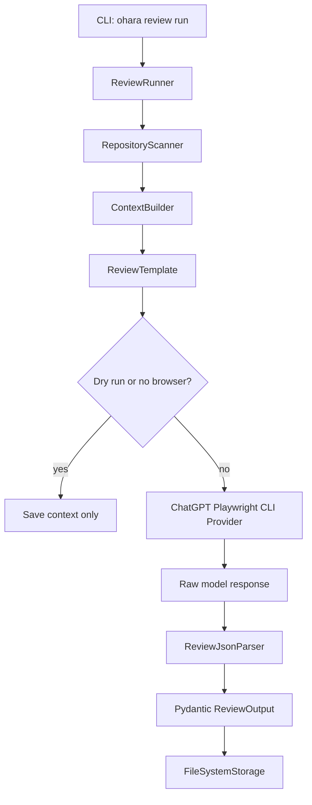

# Execution Flow



## Dry Run

Dry runs are the fastest way to inspect context quality:

```bash
uv run ohara-review run --template architecture-review --repo . --dry-run
```

Dry runs write `context.md`, `metadata.json`, `logs.txt`, and `history.jsonl`.

## Browser-Backed Run

Browser-backed runs create a context package, render the selected prompt, submit it through
the configured provider, save the raw assistant response, parse the response, and write
`review.json`.

The provider defaults to a named Playwright CLI session and persistent profile at `.ohara/playwright-cli-profile`.

If parsing or schema validation fails, Ohara still writes `raw-response.md` and
`parse-error.txt` in the run directory so the response can be inspected and recovered.
